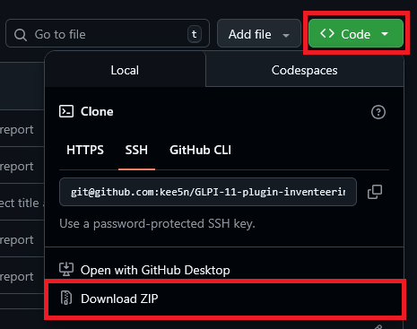
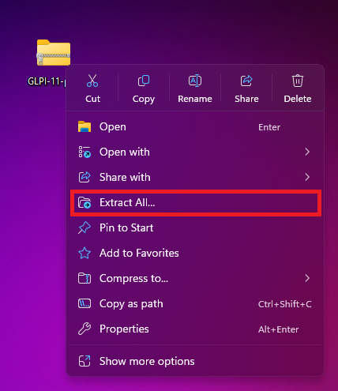
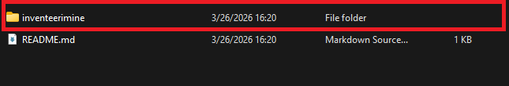

# Inventeerimine

GLPI 11 plugin

Installation guide

1. Download the file.

2.d
Extract the files after downloading.

3. Find the folder named ‘inventeerimine’ and copy it to the GLPI plugins folder.

4. Go to GLPI’s setup plugins, find the plugin, and download it.

